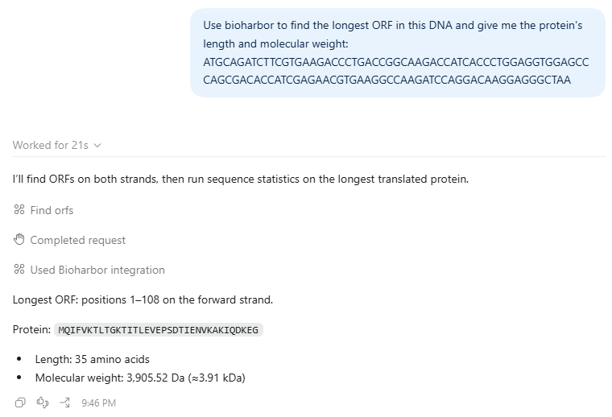

# BioHarbor

**Run real bioinformatics from your AI agent. Reliable, reproducible, on your own GPUs.**

[](https://github.com/danielLuo2/bioharbor/actions/workflows/ci.yml)
[](https://pypi.org/project/bioharbor/)
[](LICENSE)

> 🧪 **Alpha (v0.1).** Sequence tools, homology search (MMseqs2) and structure prediction
> (ESMFold, validated on RTX 5090) work. Feedback welcome — see the [roadmap](ROADMAP.md).

BioHarbor is an [MCP](https://modelcontextprotocol.io) server that lets AI agents such as
Claude, Cursor and Codex *execute* bioinformatics tools — not just look things up. Agents
ask for an analysis; BioHarbor validates the input, schedules it on a GPU with room, records
exactly how it ran, and hands back a compact, agent-readable summary.


## Why another bio MCP server?

Most bio MCP servers wrap **databases** (UniProt, PDB, PubMed…). Use them — BioHarbor
complements them by running the **compute**:

| | Database MCP servers | BioHarbor |
|---|---|---|
| Runs real analyses (search, fold, cluster) | ❌ | ✅ |
| Validates inputs *before* burning GPU time | ❌ | ✅ |
| GPU-aware queue, polite on shared GPUs | ❌ | ✅ |
| Long jobs return a `job_id` instead of timing out | ❌ | ✅ |
| Compact summaries + files on disk (saves tokens) | ❌ | ✅ |
| Provenance for every run, export to a pipeline | ❌ | ✅ (export: planned) |

## Quick start

```bash
pip install bioharbor
bioharbor doctor             # checks Python, GPUs, workspace, tools
bioharbor setup-db swissprot # reference database for search_homologs (needs MMseqs2)
bioharbor install            # shows how to connect Claude, Cursor or Codex
```

For structure prediction on a GPU: `pip install "bioharbor[esmfold]"` — see
[docs/gpu-setup.md](docs/gpu-setup.md) (RTX 50xx needs a CUDA 12.8+ PyTorch).

### Connect your agent

BioHarbor is a standard MCP server, so it works with any MCP client. One command sets up
the popular ones (it writes an absolute path, so GUI apps find it even outside your venv):

| Client | Set up |
|---|---|
| **Claude Code** | `claude mcp add bioharbor -- bioharbor serve` |
| **Claude Desktop** | `bioharbor install claude-desktop --write`, then restart the app |
| **Cursor** | `bioharbor install cursor --write`, or [](https://cursor.com/install-mcp?name=bioharbor&config=eyJjb21tYW5kIjogImJpb2hhcmJvciIsICJhcmdzIjogWyJzZXJ2ZSJdfQ==) |
| **Codex** (CLI, IDE extension, app) | `codex mcp add bioharbor -- bioharbor serve`, or `bioharbor install codex --write` |
| Anything else | run `bioharbor serve` (stdio) or `bioharbor serve --http` (Streamable HTTP) |

Long-running tools return a `job_id` within ~20 s instead of blocking, so they stay
within every client's tool-call timeout.



Step-by-step setup (local or on a GPU server,
with troubleshooting): [docs/connect-clients.md](docs/connect-clients.md).

Then ask your agent something like:

> *Find the longest ORF in this contig, translate it, search Swiss-Prot for homologs and
> predict its structure. Which regions are low confidence?*

### Use it without an agent

Every tool is also a CLI command, with identical behaviour:

```bash
bioharbor tools list
bioharbor run find_orfs sequence=@contig.fa min_aa=100 --brief   # human-readable
bioharbor run seq_stats sequence=MKTAYIAKQRQISFVKSHFSRQ
bioharbor jobs
```

### Shared GPU server

GPUs on a lab server, agent on your laptop? Run BioHarbor on the server and reach it
through an SSH tunnel; no extra port is opened on the server:

```bash
# on the GPU server
bioharbor serve --http --host 127.0.0.1 --port 8765
# on your laptop, then point Cursor / Codex / Claude Code at http://127.0.0.1:8765/mcp
ssh -N -L 8765:127.0.0.1:8765 you@gpu-server
```

> ⚠️ HTTP mode has no authentication yet (on the roadmap), so keep it on `127.0.0.1` and
> use the tunnel. Details: [docs/connect-clients.md](docs/connect-clients.md#mode-c-a-gpu-server-through-an-ssh-tunnel).

## Tools

| Tool | What it does | Runs |
|---|---|---|
| `seq_stats` | Validate sequences; type, length, GC%, molecular weight | inline |
| `translate_sequence` | DNA/RNA → protein, one or all six frames | inline |
| `find_orfs` | Longest ORFs on both strands, with coordinates | inline |
| `search_homologs` | MMseqs2 search (protein, or translated DNA) vs local DBs | job |
| `predict_structure` | ESMFold structure, pLDDT bands, low-confidence regions, pTM | job (GPU) |
| `scrna_pipeline` | scanpy QC → clustering → markers | *planned* |

Runtime tools: `get_job`, `list_jobs`, `cancel_job`, `describe_tool`, `list_databases`,
`gpu_status`, `read_file`.

## How it works

```
Agent ──MCP──▶ validate input ─▶ inline? ──yes──▶ run ─┐
                                   │ no                  ├─▶ provenance + summary ─▶ Agent
                                   ▼                     │
                     job queue (SQLite) ─▶ GPU placement ┘
                     (waits politely for a GPU with free memory)
```

- **Every call is a job** recorded in SQLite with params, versions, timings and GPU used,
  plus a `provenance.json` next to its outputs.
- **GPU placement** reads live free memory and utilisation (NVML or `nvidia-smi`), keeps
  headroom, and reserves memory for jobs it has started so two jobs never grab the same
  space. Other users' processes are respected.
- **Fail fast**: input, binaries and databases are checked *before* a job is queued, so a
  bad request never waits behind a busy GPU.
- **Results are agent-shaped**: `summary`, `message`, `files`, `suggestions`. Errors carry
  a `hint` and a `retryable` flag.

Details: [docs/design.md](docs/design.md).

## Writing a tool

```python
from pydantic import BaseModel, Field
from bioharbor.registry import Resources, RunContext, tool
from bioharbor.results import ToolResult


class FoldParams(BaseModel):
    sequence: str = Field(..., description="Protein sequence")


@tool(
    version="1",
    slow=True,
    resources=Resources(gpu=True, gpu_mem_gb=lambda p: 4 + len(p.sequence) / 100),
)
def predict_structure(params: FoldParams, ctx: RunContext) -> ToolResult:
    """Predict a protein structure with ESMFold."""
    ...
    return ToolResult(summary={"mean_plddt": 87.1}, files=["model.pdb"])
```

Plugins can ship tools in their own package via the `bioharbor.tools` entry-point group.
See [CONTRIBUTING.md](CONTRIBUTING.md).

## License

[Apache-2.0](LICENSE)
